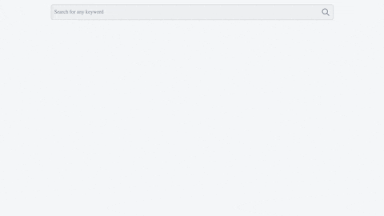

# Overview
Dictionary to learn Hindi words, their meanings, synonyms, antonyms and usage.

📖 HinDict 📖  - My new LLM powered project!

Live Demo: https://hindict.netlify.app/

## Demo

More images and videos in the `docs` folder of this repository!

## Motivations
I recently wanted to read Hindi literature, and I stumbled upon many words I didn't have in my vocabulary. I realized I am quick at reading Hindi, but slow at writing Hindi in Devanagari.

I wondered if there was an app where I could write Hindi in English / Latin alphabet (romanization) and obtain it's meaning and English equivalent. When I struggled to find one, I decided to embark on an NLP and LLM journey to make one myself.

I brushed up my skills with using open-source LLMs such as Llama3.2 and deploying them using Ollama inside a Docker container, and used prompt engineering to provide the user with a small succinct answer.

## Tech
Built the front-end in Next.js and the back-end using Flask web framework.

## Prompt Engineering
> Respond in one concise sentence without disclaimers or examples. Format: User word title-case, (user word in Hindi), refers to … (provide a definition in 5-15 words). Always conclude with this exact phrase: \'Closest English equivalent: (closest english equivalent single word)\'. Do not omit this phrase under any circumstances.

Had to add the "Do not omit this phrase under any circumstances" because the model was hallucinating.

## Thoughts
I'm pretty sure the LLM is overkill for this use-case (despite picking the small 3B parameter model), but I wanted to have fun building with LLMs. Currently fine-tuning a smaller model to save on costs.

## More demo images
#### Bhumi

#### Bhumi (dark mode)

#### Gyan

#### Manushya

#### Janma (dark mode)

### Support me if you like this project!

### Attributions
 

<a target="_blank" href="https://icons8.com/icon/OWrbstths95S/dictionary">Dictionary</a> icon by <a target="_blank" href="https://icons8.com">Icons8</a>
